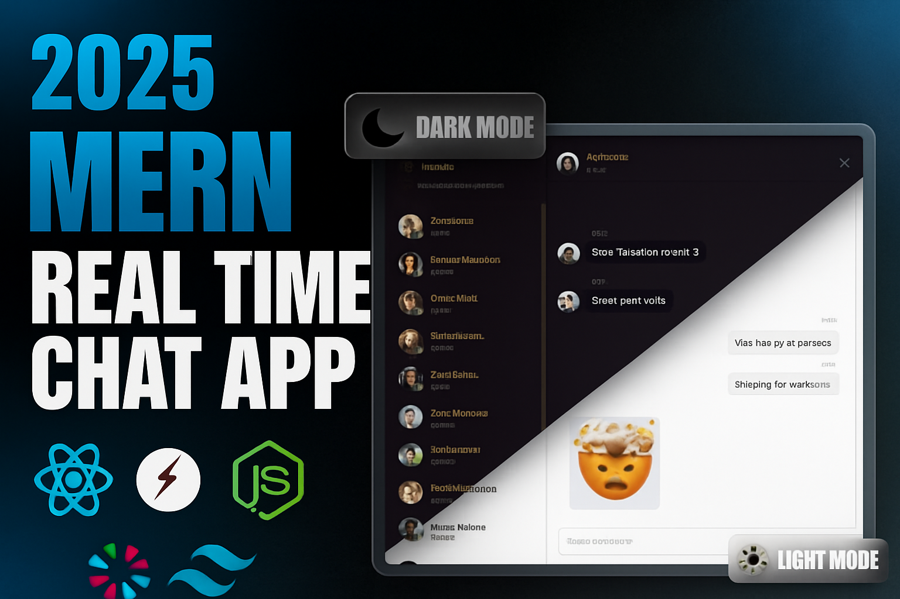

# 🎉 Chat App

<h4>ChatApp is a full-stack real-time messaging platform built with the MERN stack, Socket.io, and a beautifully crafted UI powered by TailwindCSS and DaisyUI.
It features secure JWT-based authentication, online status tracking, instant message delivery, and global state management with Zustand, offering a smooth and responsive chat experience.
Perfect for learning real-time systems, practicing full-stack workflows, or showcasing a production-ready chat application.</h4>


[](https://opensource.org/licenses/MIT)
[](https://reactjs.org/)
[](https://nodejs.org/)
[](https://socket.io/)
[](https://www.mongodb.com/)
[](https://tailwindcss.com/)
[](https://chat-app-f2r7.onrender.com/)


---

## 🖼 UI Screenshots

<div align="center">
 
</div>

---

## 💎 Features

<div style="display:flex; flex-wrap:wrap; gap:10px;">
  <div>🎃 JWT Authentication & Authorization</div>
  <div>👾 Real-time Messaging (Socket.io)</div>
  <div>🚀 Online User Status</div>
  <div>👌 Zustand Global State Management</div>
  <div>🐞 Client & Server Error Handling</div>
</div>

---

## 🛠 Tech Stack
**MERN + TailwindCSS + DaisyUI + Socket.io**

| Frontend | Backend | Real-time |
|----------|---------|----------|
| React.js | Node.js | Socket.io |
| TailwindCSS | Express.js|
| DaisyUI | MongoDB|
| Zustand |  JWT |
---

## ⚡ Installation


1. Clone the Repository
 ```
git clone https://github.com/hilla10/ChatApp.git
cd ChatApp
```
3. Backend Setup
```
cd backend
npm install
npm run dev
```

Create a .env file in backend/ with:
```
PORT=3000
MONGO_URI=your_mongodb_connection
JWT_SECRET=your_jwt_secret
CLOUDINARY_CLOUD_NAME=your_cloudinary_name
CLOUDINARY_API_KEY=your_cloudinary_key
CLOUDINARY_API_SECRET=your_cloudinary_secret
NODE_ENV = development
CLIENT_URL = http://localhost:5173
```
3. Frontend Setup
```
cd ../frontend
npm install
npm run dev

```
Create a .env file in frontend/ with:
```
VITE_BASE_URI=http://localhost:3000
```


## 📁 Folder Structure
```bash
ChatApp/
 ├── frontend/
 │   └── src/
 │       ├── components/
 │       ├── pages/
 │       ├── lib/
 │       └── utils/
 └── backend/
     ├── controllers/
     ├── models/
     ├── routes/
     ├── middleware/
     └── lib/
```


## 🤝 Contributing
1, Fork this repo

2, Create your feature branch

3, Commit changes

4, Open a Pull Request

## 📄 License

Licensed under the MIT License.

📬 Contact

Author: Hailemichael

🌐 Portfolio: [ portfolio](https://portfolio-rho-gules-15.vercel.app/)

💼 LinkedIn:[Linkedin](https://www.linkedin.com/in/hailemichaelnegusse/)

